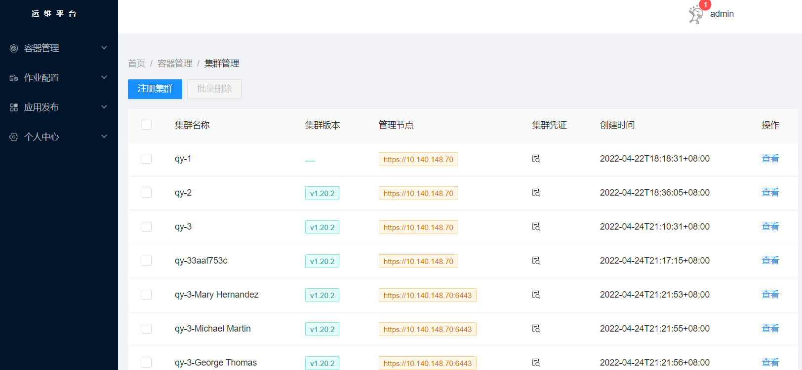
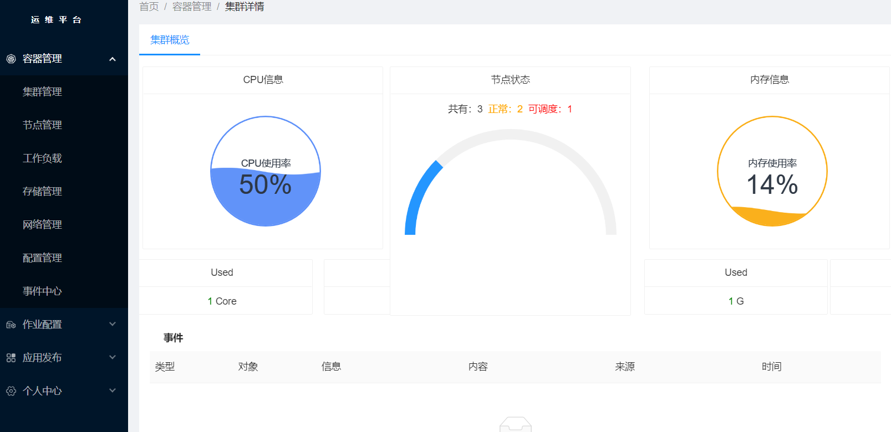
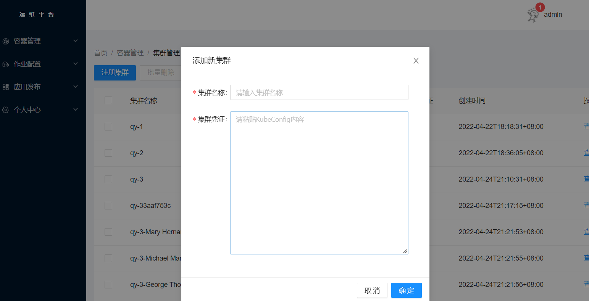

# kube_web
基于kube client的前后端分析项目

##项目目录介绍
```shell
deploy #目录是部署相关文件
src #源代码目录
src/backend #后端业务代码
src/frontend #前端业务代码
Makefile 
```

## 相关信息
- 编程框架：[beego](https://beego.me/)
- 构建工具：[bee](https://beego.me/)
- 前端框架: [ant-design](https://github.com/ant-design/ant-design-pro)

## 启动方式

```sh
#后端
cd src/backend/
go mod tidy
bee run

#前端
cd src/frontend
npm install
npm run dev
```

## 展示








## 进度
```shell
20220327 login
20220330 集群列表
20220412 集群资源利用
20220429 添加集群
```